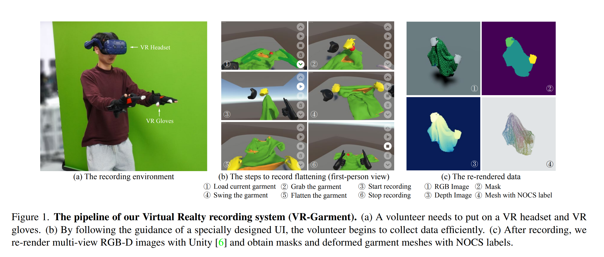
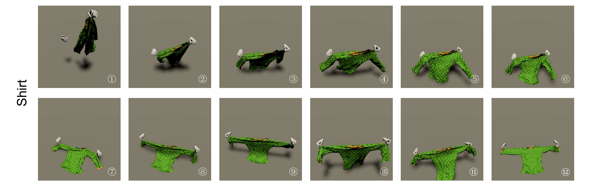

# VR-Garment
This project is used for collecting garment manipulation data with human hands in VR, which is the default data recording system for [GarmentTracking (CVPR 2023)](https://github.com/xiaoxiaoxh/GarmentTracking).


## Data Examples


## Hardware
This project needs to be used with the following hardware devices.

[VIVE Pro](https://www.vive.com/us/product/vive-pro2-full-kit/overview/): VR HMD.

[VIVE Tracker (3.0)](https://www.vive.com/us/accessory/tracker3/): Hand tracking devices.

[VRTRIX Data Gloves](http://www.vrtrix.com.cn/product/data-gloves/): 6-node data glove.

 

## Environment

1. Clone Project.
   
   ```
   git clone https://github.com/xiaoxiaoxh/VR-Garment.git
   ```

2. Install Unity Hub and install Unity Editor 2021.3 LTS through Hub.
   
   [Download the Unity Hub](https://unity.com/download)

3. Install Steam, and install SteamVR via Steam.
   
   [SteamVR on Steam](https://store.steampowered.com/app/250820/SteamVR/)

4. Install VRTRIX Data Glove Software.
   
   [VRTRIXGloveInstaller](http://www.vrtrix.com.cn/product/data-gloves/#developer)

5. Configure and connect the devices correctly according to the documentation of the headset, tracker, and gloves.
   
   [VIVE Pro Support](https://www.vive.com/us/support/vive-pro/)
   
   [VIVE Tracker (3.0) Support](https://www.vive.com/us/support/tracker3/)
   
   [VRTRIXGloveInstaller](http://www.vrtrix.com.cn/product/data-gloves/#developer)


## Play Scene

Open the vr-garment project with Unity, there are two scenes in the project:


**Assets\Scenes\Imitation2\ClothImitation2**：Use this scene to manually fold clothes in a VR environment, and the program will record the data during the process.

The parameters of the main script:


A part of the clothing model packaged by AssetBundle has been built into the project.


**Assets\Scenes\Imitation2\AnimationImitation2**：This scene restores the process of folding clothes according to the data recorded in ClothImitation2, and saves information such as high-quality depth maps.

The parameters of the main script:


Download the Demo Captures data from [Release](https://github.com/xiaoxiaoxh/VR-Garment/releases/download/Captures/Captures.zip) and decompress it, modify the `LoadJsonDir` parameter of the `AnimateImitation2` script to your decompression path, or decompress it to the project `Assets/Captures`
